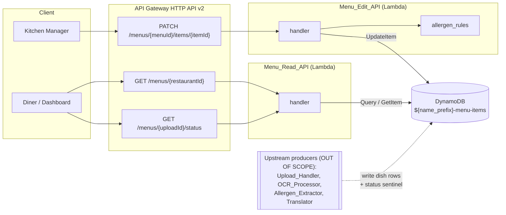
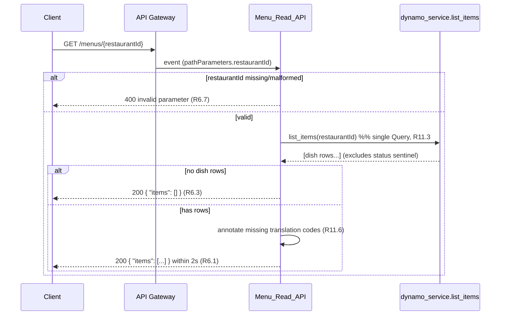
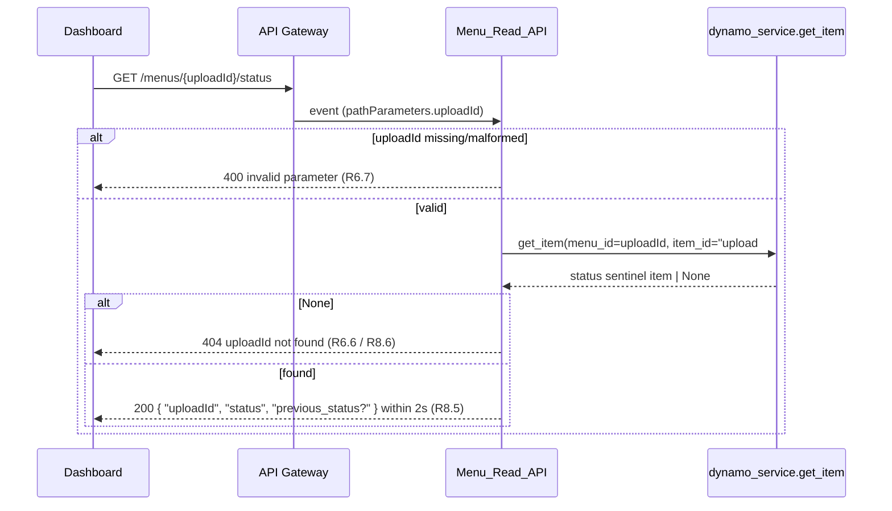
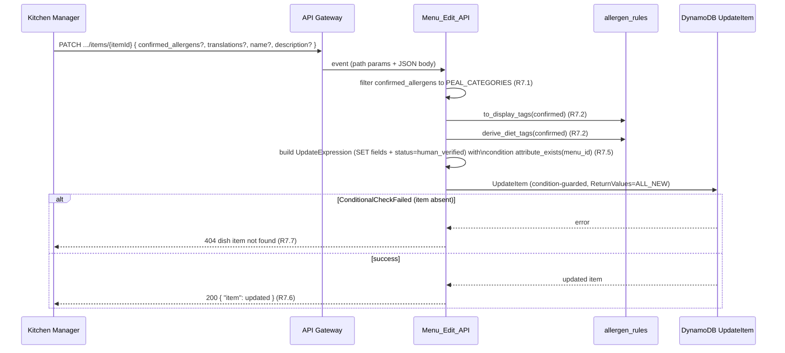

# Design Document: Menu_Read_API and Menu_Edit_API

## Overview

This design covers **only two** of the six Lambda functions in the Beanstalk-to-Lambda
migration: **Menu_Read_API** (the read-only, customer-facing / dashboard-polling
function) and **Menu_Edit_API** (the human-in-the-loop allergen override function).

The other four functions — **Upload_Handler**, **OCR_Processor**, **Allergen_Extractor**,
and **Translator** — are treated here as **already-defined external components**. They
are the *upstream producers* of the data that Menu_Read_API reads and that Menu_Edit_API
mutates. This document does **not** design their internals. It does, however, pin down
one **data contract** those producers must honour: the shape of the upload-status record
(see [Open Question 1](#open-question-1-upload-status-storage)), because Menu_Read_API's
`GET /menus/{uploadId}/status` endpoint depends on it and Upload_Handler is the writer.

Scope boundaries:

- **In scope:** the HTTP handlers, request/response contracts, DynamoDB access patterns,
  IAM execution roles, and deployment packaging for Menu_Read_API and Menu_Edit_API.
- **Out of scope:** OCR, Bedrock extraction, translation generation, Textract wiring, the
  asynchronous status-advancement logic inside the pipeline (R8.2/R8.3/R8.4 are *enforced
  by the producers*, not by these two functions). Menu_Read_API only *observes* the
  Status_Field; Menu_Edit_API never touches it except to set `human_verified`.

Requirements addressed: **R6** (menu read + status polling), **R7** (override),
**R9.6 / R9.7** (scoped IAM for these two roles) plus baseline **R9.8 / R9.9**, and **R11**
(embedded translations schema). Cross-cutting: **R1.7** (Menu_Edit_API must call the real
`allergen_rules` functions), **R8.5 / R8.6** (status-poll latency + not-found).

### Grounding facts this design must not contradict

- `app/services/dynamo_service.py` **exists and must not be modified** (R1.1). Its public
  surface both Lambdas rely on:
  - `put_item(item) -> Dict` — full-table **PutItem** overwrite; auto-generates `item_id`,
    sets `updated_at`. Requires `dynamodb:PutItem`.
  - `list_items(menu_id) -> List[Dict]` — single **Query** on `menu_id`.
  - `get_item(menu_id, item_id) -> Optional[Dict]` — single **GetItem**.
- Table schema: `hash_key = menu_id (S)`, `range_key = item_id (S)`, one row per dish,
  `PAY_PER_REQUEST`. **No dedicated upload-status item type exists today.**
- `app/services/allergen_rules.py` **exists**, exposing the real `to_display_tags`,
  `derive_diet_tags`, and `PEAL_CATEGORIES`. Menu_Edit_API must call these (R1.7 / R7.2).

## Architecture

Both functions sit behind the API Gateway **HTTP API (v2)** defined by Requirement 10 and
share the single DynamoDB table `${name_prefix}-menu-items`. Neither talks to the other;
they are independent handlers with independent, minimal execution roles.



### Sequence: GET /menus/{restaurantId} (R6.1, R6.2, R6.3, R11.3, R11.6)



Note: `list_items` returns **all** rows under the `menu_id` partition in a single Query.
The status sentinel row (Open Question 1) shares the partition, so Menu_Read_API must
**filter it out** of the dish collection returned by `GET /menus/{restaurantId}`.

### Sequence: GET /menus/{uploadId}/status (R6.4, R8.5, R8.6)



### Sequence: PATCH /menus/{menuId}/items/{itemId} (R7.1–R7.7, R1.7)



## Components and Interfaces

### Menu_Read_API

- **Trigger:** API Gateway HTTP API v2 proxy integration for two routes.
- **Endpoints:**
  - `GET /menus/{restaurantId}` → `list_items(restaurantId)`, filter out the status
    sentinel, annotate missing translation codes, return `{ "items": [...] }`.
  - `GET /menus/{uploadId}/status` → `get_item(uploadId, "upload#" + uploadId)`, return
    `{ "uploadId", "status", "previous_status"? }`.
- **Persistence calls:** `dynamo_service.list_items` (Query) and `dynamo_service.get_item`
  (GetItem) **only**. No writes (R6.5).
- **Handler dispatch:** the handler distinguishes the two routes by the API Gateway
  `routeKey` (or resource path template), not by parsing the raw path, so `{restaurantId}`
  vs `{uploadId}/status` are never confused.

### Menu_Edit_API

- **Trigger:** API Gateway HTTP API v2 proxy integration for `PATCH /menus/{menuId}/items/{itemId}`.
- **Behavior:** replicates the current Flask `update_item` override semantics (R7.1–R7.6)
  but as a **native DynamoDB UpdateItem** rather than a read-modify-write (see
  [Open Question 2](#open-question-2-menu_edit_api-permission-tension)).
- **Business-logic calls:** the **real** `allergen_rules.to_display_tags` and
  `allergen_rules.derive_diet_tags` (R1.7 / R7.2). No placeholder logic.
- **Persistence:** a direct `boto3` `table.update_item(...)` call with an
  `UpdateExpression`, a `ConditionExpression` of `attribute_exists(menu_id)`, and
  `ReturnValues="ALL_NEW"`. It does **not** call `dynamo_service.put_item` (which would
  require `dynamodb:PutItem`, outside the role's grant).

### Shared request/response contract

- Success bodies are JSON. Error bodies are `{ "error": "<description>" }` with the HTTP
  status codes enumerated in R6 and R7.
- Path parameters arrive via the API Gateway v2 event `pathParameters` map.

## Data Models

### Dish item (produced by Translator; read by Menu_Read_API; mutated by Menu_Edit_API)

Per R11, all translations are embedded in the dish row — no separate translation items.

```json
{
  "menu_id": "kiwi-cafe-queenstown",
  "item_id": "dish-1a2b3c4d",
  "name": "Seafood Chowder",
  "description": "Creamy chowder with fish, prawns and mussels",
  "source": "upload",
  "status": "ready",
  "allergens": {
    "confirmed": ["Fish", "Crustacea", "Milk", "Gluten (Cereals)"],
    "display_tags": ["Contains Fish", "Contains Crustacea", "Contains Milk", "Contains Wheat/Gluten"],
    "llm_reasoning": "…",
    "disagreements": { "llm_only": [], "rule_only": ["Milk"] }
  },
  "diet_tags": [],
  "translations": {
    "es": { "name": "…", "description": "…" },
    "de": { "name": "…", "description": "…" },
    "ja": { "name": "…", "description": "…" },
    "zh": { "name": "…", "description": "…" }
  },
  "updated_at": 1730000000
}
```

Configured_Languages are exactly `es`, `de`, `ja`, `zh` (from `bedrock_service.LANGUAGES`).
Per R11.6, if `translations` is missing one of these codes, Menu_Read_API returns whatever
entries exist and marks each missing code unavailable (it does **not** synthesize a
translation, and it does **not** write anything).

### Upload-status sentinel item (data contract for Upload_Handler; read by Menu_Read_API)

See [Open Question 1](#open-question-1-upload-status-storage) for the justification. Shape:

```json
{
  "menu_id": "<uploadId>",
  "item_id": "upload#<uploadId>",
  "record_type": "upload_status",
  "status": "processing",
  "previous_status": "processing",
  "error": null,
  "updated_at": 1730000000
}
```

Here `uploadId == menu_id` for the upload's partition. The reserved `item_id` prefix
`upload#` distinguishes the status sentinel from dish rows (`dish-*`).

---

## Resolution of Open Design Questions

### Open Question 1: Upload-status storage

**Decision:** Store upload status as a **sentinel row in the same table**, under
`menu_id = uploadId` and a reserved `item_id = "upload#" + uploadId`.

**How `GET /menus/{uploadId}/status` maps to a key:** Menu_Read_API constructs the key
deterministically — `get_item(menu_id=uploadId, item_id="upload#"+uploadId)`. This is a
single GetItem, so it satisfies the 2-second latency requirement (R8.5) and the read-only
constraint (R6.5). If GetItem returns `None`, the function returns 404 (R6.6 / R8.6).

**Why this shape (evaluated against the alternatives):**

- **Fixed `dynamo_service` signatures.** `get_item(menu_id, item_id)` and
  `list_items(menu_id)` key *only* on `menu_id`/`item_id`. A sentinel row fits these
  signatures exactly with no module change (respecting R1.1) — Menu_Read_API can read the
  status via the existing `get_item`. A **separate status table** would require a new
  client/table reference that `dynamo_service` does not expose, forcing either a
  modification (forbidden) or a bypass of the persistence layer.
- **Read-only permission scope.** Menu_Read_API is limited to `dynamodb:GetItem` +
  `dynamodb:Query` on the one table ARN (R9.6). A sentinel row in that same table is fully
  reachable with exactly those two actions and one ARN — no extra grant. A separate table
  would widen the resource scope (a second ARN), pushing against R9.9's "specific target
  resource ARNs" intent.
- **Upstream producer contract.** Upload_Handler already must create a DynamoDB item on
  upload (R2.2). Making that item the sentinel row (same partition, reserved `item_id`)
  means the producer writes one well-defined record. The pipeline stages (OCR_Processor,
  Allergen_Extractor, Translator) advance `status` on this same sentinel row.

**Alternatives rejected:**

- *Separate status table:* cleaner conceptual separation, but breaks the fixed
  `dynamo_service` interface and adds a second ARN to every role — rejected.
- *Status as an attribute on each dish row only (no sentinel):* fails because at
  upload time (status `processing`/`ocr_done`) there are **no dish rows yet** — dishes only
  exist after extraction. There would be nothing to GetItem for `GET /…/status`. Rejected.

**Required Upload_Handler contract (unambiguous, so the separately-built producer conforms):**
On `POST /menus/upload`, Upload_Handler MUST write a sentinel item with:
`menu_id = <uploadId>`, `item_id = "upload#" + <uploadId>`, `record_type = "upload_status"`,
`status = "processing"`, `previous_status = "processing"`, and `updated_at`. The pipeline
stages update `status` (and, on failure, `previous_status` + `error` per R8.7) on that same
key. Menu_Read_API reads it verbatim and never mutates it.

> Note: `dynamo_service.put_item` auto-generates `item_id` **only if absent**. Upload_Handler
> must set `item_id="upload#<uploadId>"` explicitly so the sentinel key is deterministic and
> pollable. This is a producer-side obligation, documented here for contract clarity; the
> producer's internals remain out of scope.

### Open Question 2: Menu_Edit_API permission tension (UpdateItem-only vs read-modify-write)

**The tension:** The current Flask override is read-modify-write — `get_item` then
`put_item`. But R9.7 scopes Menu_Edit_API to `dynamodb:UpdateItem` **only**: no `GetItem`,
no `PutItem`. Calling `dynamo_service.put_item` as-is would require `dynamodb:PutItem` and
therefore **violate R9.7**.

**Decision (option a): Redesign the override as a native DynamoDB UpdateItem with an
update expression and a condition — no prior read, no PutItem.**

Rationale — the prior read is avoidable:

- **Allergen recompute needs only the request body, not stored state.** `to_display_tags`
  and `derive_diet_tags` take the *confirmed allergen set*, which comes entirely from the
  request's `confirmed_allergens`. After PEAL filtering (R7.1) the function has everything
  it needs to compute `display_tags` and `diet_tags` without reading the existing item
  (R7.2). This differs from the Flask code only in that Flask read the row first out of
  convenience, not necessity.
- **Translation merge is a map merge, which UpdateItem does natively.** R7.3 requires
  merging provided translations while preserving codes not in the request. A DynamoDB
  `UpdateExpression` sets individual map paths: `SET translations.#es = :es` per provided
  code, leaving other code keys untouched. This achieves the "preserve existing entries"
  guarantee **without** reading the current map. (Requires `translations` to already exist
  as a map — true for any finalized dish; for robustness the expression can seed it.)
- **Partial field updates map directly.** `name`, `description`, and `status =
  human_verified` (R7.4/R7.5) are `SET` clauses added only when present in the body.
- **404 without GetItem.** The "item does not exist → 404" requirement (R7.7) is enforced
  with a `ConditionExpression = attribute_exists(menu_id)`. A `ConditionalCheckFailedException`
  is translated to HTTP 404. This needs no read permission.

Data flow (explicit): request body → PEAL-filter `confirmed_allergens` → call the real
`allergen_rules.to_display_tags` / `derive_diet_tags` → assemble one `UpdateExpression`
(`SET allergens.confirmed, allergens.display_tags, diet_tags, status`, plus optional
`name`, `description`, and per-code `translations.<code>`) → `table.update_item(Key={menu_id,
item_id}, UpdateExpression=…, ConditionExpression=attribute_exists(menu_id),
ReturnValues="ALL_NEW")`. On success return the `Attributes` (ALL_NEW) as the item; on
conditional failure return 404.

This keeps the role at exactly `dynamodb:UpdateItem` (R9.7) and preserves every behavioral
guarantee of the original override. `dynamo_service.put_item` is deliberately **not** used
here; `dynamo_service` remains unmodified (R1.1) and is simply not the persistence path for
this one function.

### Open Question 3: Lambda deployment package structure

**Decision:** Ship the shared Python service modules as a **single Lambda Layer** consumed
by both functions; each function package contains only its own handler.

Rationale: `allergen_rules.py` (needed by Menu_Edit_API per R1.7) and `dynamo_service.py`
(needed by Menu_Read_API) are shared, unmodified modules (R1.1). A layer keeps **one**
authoritative copy — critical to the R1.1 "byte-for-byte identical" guarantee, since a
bundled-copy approach risks the copies drifting and is easy to accidentally edit. All six
functions in the wider migration reuse the same layer, so the layer is the natural home.

Layer + function layout:

```
build/
├── layer/
│   └── python/
│       └── services/
│           ├── __init__.py
│           ├── allergen_rules.py      # copied verbatim from app/services (R1.1)
│           ├── dynamo_service.py       # copied verbatim from app/services (R1.1)
│           ├── bedrock_service.py      # (used by other funcs; present in shared layer)
│           ├── s3_service.py
│           └── textract_service.py
│
├── menu_read_api/
│   └── handler.py                      # imports: from services import dynamo_service
│
└── menu_edit_api/
    └── handler.py                      # imports: from services import allergen_rules
```

- Layer content lives under `python/` so Lambda puts it on `sys.path`; handlers do
  `from services import allergen_rules` / `from services import dynamo_service`.
- Menu_Edit_API imports `allergen_rules` from the layer and calls DynamoDB via `boto3`
  directly (its own `update_item` path), so it does **not** need `dynamo_service`.
- Menu_Read_API imports `dynamo_service` from the layer for its Query/GetItem calls.
- The copy step (`app/services/*.py` → `build/layer/python/services/`) is a pure copy — no
  edits — enforcing R1.1.

*Bundled-copy alternative rejected:* duplicating the service modules into each function zip
multiplies the number of physical copies of files that must stay byte-for-byte identical,
increasing the risk of accidental divergence and violating the spirit of R1.1.

---

## Error Handling

| Endpoint | Condition | Status | Body | Requirement |
|---|---|---|---|---|
| `GET /menus/{restaurantId}` | missing/malformed `restaurantId` | 400 | `{"error": "invalid restaurantId"}` | R6.7 |
| `GET /menus/{restaurantId}` | restaurant has no dishes | 200 | `{"items": []}` | R6.3 |
| `GET /menus/{restaurantId}` | restaurant does not exist | 404 | `{"error": "restaurant not found"}` | R6.6 |
| `GET /menus/{uploadId}/status` | missing/malformed `uploadId` | 400 | `{"error": "invalid uploadId"}` | R6.7 |
| `GET /menus/{uploadId}/status` | no sentinel item for uploadId | 404 | `{"error": "uploadId not found"}` | R6.6 / R8.6 |
| `PATCH /…/items/{itemId}` | dish item absent (condition fails) | 404 | `{"error": "dish item not found"}` | R7.7 |

Notes:

- Distinguishing R6.3 (existing restaurant, no dishes → 200 empty) from R6.6 (restaurant
  does not exist → 404) for `GET /menus/{restaurantId}`: a `list_items` Query cannot by
  itself tell "no such restaurant" from "restaurant with zero dishes". The design treats a
  restaurant as *existing* if the partition contains any row (dish rows and/or an upload
  sentinel). If the Query returns zero rows total, the restaurant is unknown → 404; if it
  returns only non-dish rows or one-or-more dish rows, it exists → 200 (empty list when no
  dish rows). This is a single Query, preserving read-only + latency guarantees.
- "Malformed" means empty/whitespace-only or containing characters outside the permitted
  key charset; validated before any DynamoDB call so a rejected request makes no data change
  (R6.7).
- No unhandled write path exists in Menu_Read_API, upholding R6.5.

## Testing Strategy

The two functions contain genuine pure logic worth property-testing: PEAL filtering + tag
recomputation (Menu_Edit_API), translation-map completeness annotation and status-sentinel
filtering (Menu_Read_API). DynamoDB itself is mocked (via a stubbed `boto3`/table or a
local in-memory fake) so property runs stay cheap and test *our* logic, not AWS.

**Dual approach:**

- **Property-based tests** (min **100 iterations** each) for the universal properties in the
  next section. Library: **Hypothesis** (Python). Each test tagged
  `# Feature: beanstalk-to-lambda-migration, Property N: <text>`.
- **Example / edge-case unit tests** for: 400 on malformed path param; 404 on missing
  restaurant, missing uploadId sentinel, and missing dish item; 200-empty for a restaurant
  with only a sentinel row; the status-sentinel row being excluded from
  `GET /menus/{restaurantId}` results.
- **Integration tests** (1–2 examples) for API Gateway v2 event shape → handler dispatch by
  `routeKey`, and for the `ConditionExpression` producing a 404 against a real/local table.

Generators are constrained to produce realistic dish items (valid Configured_Languages
subsets, PEAL and non-PEAL allergen strings, whitespace/edge path params).

## Correctness Properties

*A property is a characteristic or behavior that should hold true across all valid
executions of a system — essentially, a formal statement about what the system should do.
Properties serve as the bridge between human-readable specifications and machine-verifiable
correctness guarantees.*

Each property below is implemented by a **single** property-based test running a **minimum
of 100 iterations**, tagged
`# Feature: beanstalk-to-lambda-migration, Property N: <text>`. DynamoDB is mocked so the
tests exercise our logic, not AWS.

### Property 1: Read returns exactly the stored dishes (with translations) in one query, sentinel excluded

*For any* restaurant partition containing an arbitrary set of dish rows plus at most one
upload-status sentinel row, `GET /menus/{restaurantId}` returns a collection equal to the
set of dish rows (the sentinel row excluded), each dish carrying its embedded
Translations_Map unchanged, obtained via exactly one `list_items` Query and zero
per-translation queries.

**Validates: Requirements 6.1, 6.2, 11.3**

### Property 2: Missing translation codes are reported exactly

*For any* dish whose Translations_Map contains an arbitrary subset of Configured_Languages
(`es`, `de`, `ja`, `zh`), the read output includes every present code's entry and flags
each absent code as unavailable, such that the union of (present entries) and (flagged
missing codes) is exactly the four Configured_Languages, with no fabricated translation
content.

**Validates: Requirements 11.6**

### Property 3: Menu_Read_API never mutates stored data

*For any* request to either read endpoint — valid, malformed, or targeting an absent
resource — Menu_Read_API issues no write operation (no PutItem, UpdateItem, or DeleteItem)
against DynamoDB.

**Validates: Requirements 6.5, 6.6, 6.7**

### Property 4: Status endpoint faithfully returns the stored status

*For any* upload-status sentinel with a stored Status_Field value, `GET /menus/{uploadId}/status`
returns exactly that stored value (never an earlier or fabricated value); and *for any*
uploadId with no sentinel item, it returns 404 without a Status_Field value. Consequently,
across a sequence of polls where the stored value only advances, the values observed by the
read API never regress.

**Validates: Requirements 6.4, 6.6, 8.5, 8.6**

### Property 5: Override retains only PEAL categories

*For any* list of proposed confirmed allergens mixing valid and invalid values, the
confirmed set applied by Menu_Edit_API equals the input intersected with
`allergen_rules.PEAL_CATEGORIES` (all non-members silently discarded).

**Validates: Requirements 7.1**

### Property 6: Derived tags match the real allergen_rules functions

*For any* filtered confirmed allergen set, the `display_tags` and `diet_tags` written by
Menu_Edit_API equal `allergen_rules.to_display_tags(confirmed)` and
`allergen_rules.derive_diet_tags(confirmed)` respectively (the handler reuses those
functions rather than reimplementing the logic).

**Validates: Requirements 1.7, 7.2**

### Property 7: Translation merge preserves untouched codes

*For any* existing Translations_Map and *any* partial translation update in a request, the
resulting map equals the existing map overlaid with the update: every code present in the
request takes the request's value, and every code absent from the request retains its prior
value.

**Validates: Requirements 7.3**

### Property 8: Successful override sets status to human_verified

*For any* override request applied to an existing dish item, the resulting item's status is
`human_verified`, regardless of which optional fields the request included.

**Validates: Requirements 7.5**

### Property 9: Override on an absent item fails closed with no change

*For any* `PATCH` targeting a `menu_id`/`item_id` that does not exist, Menu_Edit_API responds
404 and the conditional UpdateItem makes no change to stored data.

**Validates: Requirements 7.6, 7.7**

---

## Requirements Traceability

| Requirement | Design element(s) |
|---|---|
| R6.1 | GET /menus/{restaurantId} sequence; `list_items` single Query; Property 1 (return completeness) + latency integration test |
| R6.2 / R11.3 | Single-Query read pattern; Property 1 (translations embedded, one read) |
| R6.3 | Error Handling table (200-empty vs 404 semantics); example/edge test |
| R6.4 / R8.5 | GET /menus/{uploadId}/status sequence; sentinel GetItem; Property 4 |
| R6.5 | Menu_Read_API "read-only" component note; Property 3 |
| R6.6 / R8.6 | Error Handling (404 unknown id); Open Question 1 key mapping; Property 3, Property 4 |
| R6.7 | Path-param validation before DynamoDB call; Error Handling (400); Property 3 |
| R7.1 | Menu_Edit_API PEAL filter step; Property 5 |
| R7.2 / R1.7 | Menu_Edit_API calls real `to_display_tags` / `derive_diet_tags`; layer packaging (OQ3); Property 6 |
| R7.3 | UpdateExpression per-code map SET (OQ2); Property 7 |
| R7.4 | Optional `name`/`description` SET clauses; example test |
| R7.5 | `SET status = human_verified`; Property 8 |
| R7.6 | Native conditional UpdateItem persistence (OQ2); Property 9 |
| R7.7 | `ConditionExpression attribute_exists(menu_id)` → 404; Property 9 |
| R9.6 | Menu_Read_API IAM policy (GetItem + Query, table ARN) — see below |
| R9.7 | Menu_Edit_API IAM policy (UpdateItem only, table ARN); OQ2 resolves the read-modify-write tension |
| R9.8 | Baseline CloudWatch Logs statement in both policies |
| R9.9 | Both DynamoDB statements scoped to the specific table ARN, not `*` |
| R11.1 / R11.3 | Dish item data model with embedded `translations`; Property 1 |
| R11.6 | Missing-code annotation on read; Property 2 |

## IAM Execution Role Policies

Both policies scope DynamoDB actions to the specific table ARN (R9.9) and include the
baseline CloudWatch Logs statement scoped to the function's own log group (R9.8). The table
ARN is `arn:aws:dynamodb:${region}:${account_id}:table/${name_prefix}-menu-items` (the table
resource is defined in the unmodified `terraform/dynamodb.tf`).

### Menu_Read_API execution role policy (R9.6, R9.8, R9.9)

```json
{
  "Version": "2012-10-17",
  "Statement": [
    {
      "Sid": "MenuReadDynamoReadOnly",
      "Effect": "Allow",
      "Action": [
        "dynamodb:GetItem",
        "dynamodb:Query"
      ],
      "Resource": "arn:aws:dynamodb:ap-southeast-2:123456789012:table/allergen-menu-items"
    },
    {
      "Sid": "MenuReadBaselineLogs",
      "Effect": "Allow",
      "Action": [
        "logs:CreateLogGroup",
        "logs:CreateLogStream",
        "logs:PutLogEvents"
      ],
      "Resource": "arn:aws:logs:ap-southeast-2:123456789012:log-group:/aws/lambda/allergen-menu-read-api:*"
    }
  ]
}
```

### Menu_Edit_API execution role policy (R9.7, R9.8, R9.9)

```json
{
  "Version": "2012-10-17",
  "Statement": [
    {
      "Sid": "MenuEditDynamoUpdateOnly",
      "Effect": "Allow",
      "Action": [
        "dynamodb:UpdateItem"
      ],
      "Resource": "arn:aws:dynamodb:ap-southeast-2:123456789012:table/allergen-menu-items"
    },
    {
      "Sid": "MenuEditBaselineLogs",
      "Effect": "Allow",
      "Action": [
        "logs:CreateLogGroup",
        "logs:CreateLogStream",
        "logs:PutLogEvents"
      ],
      "Resource": "arn:aws:logs:ap-southeast-2:123456789012:log-group:/aws/lambda/allergen-menu-edit-api:*"
    }
  ]
}
```

Notes:

- Region/account/table-name segments are shown as literals for clarity; in Terraform they
  are composed from `data.aws_caller_identity.current.account_id`, the provider region, and
  `${local.name_prefix}-menu-items`.
- Menu_Edit_API grants **no** `dynamodb:GetItem` and **no** `dynamodb:PutItem` — this is
  exactly why the override was redesigned to a native `UpdateItem` in Open Question 2.
- Menu_Read_API grants **no** write actions — enforcing R6.5 at the IAM layer as well as in
  code (Property 3).

