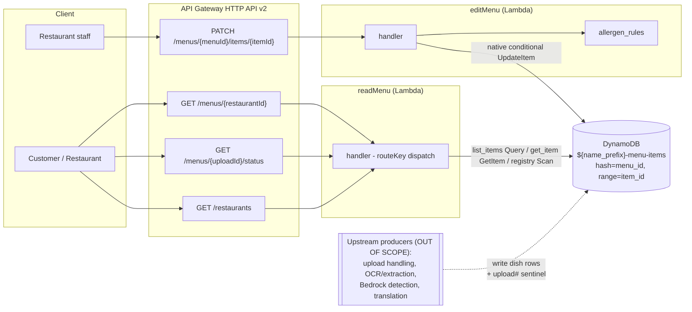
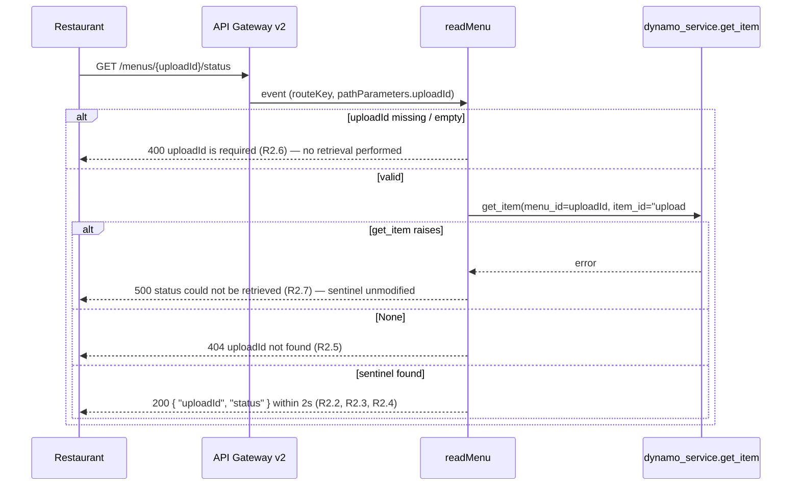

# Design Document: readMenu and editMenu

## Overview

This design covers exactly two AWS Lambda functions that expose the already-saved menu data
of the allergen-compliance system: **readMenu** (read-only menu view + upload-status
polling) and **editMenu** (human-in-the-loop dish correction). Both sit behind the API
Gateway **HTTP API (v2)** and operate over a single shared DynamoDB table keyed by
`menu_id` (hash) and `item_id` (range).

The functions **reuse two existing modules verbatim**:

- `app/services/dynamo_service.py` — `list_items(menu_id)` (a single **Query**) and
  `get_item(menu_id, item_id)` (a single **GetItem**) for readMenu's per-restaurant routes.
  readMenu's `GET /restaurants` instead issues a direct `boto3` **Scan** filtered to the
  restaurant registry rows (rather than `dynamo_service.list_menus()`), so a restaurant's
  existence is independent of its dish rows.
- `app/services/allergen_rules.py` — the real `PEAL_CATEGORIES`, `to_display_tags`, and
  `derive_diet_tags` for editMenu.

### Scope boundaries

- **In scope:** the two HTTP handlers, their request/response contracts, DynamoDB access
  patterns, the two IAM execution roles, and the deployment packaging for readMenu and
  editMenu.
- **Out of scope (upstream producers):** upload handling, OCR / text extraction, Bedrock
  allergen detection, and translation generation. These four components are the *producers*
  that write dish rows and the upload-status sentinel row to the same table. This document
  does **not** design their internals. It **does** pin down one data contract they must
  honour — the shape of the upload-status sentinel row — because readMenu's
  `GET /menus/{uploadId}/status` endpoint reads it and the out-of-scope upload handler is
  its writer.

readMenu only *observes* the sentinel's `status`; it never writes. editMenu never touches
the sentinel; it only sets a dish's `status` to `human_verified`.

Requirements addressed: **R1** (view a restaurant's saved menu), **R2** (check upload
status), **R3** (readMenu is read-only + validates input), **R4** (correct a saved dish),
**R5** (persist corrections + mark human-verified), **R6** (list all restaurants),
**R7** (admin authentication for editing).

### Grounding facts this design must not contradict

- `app/services/dynamo_service.py` **exists and is not modified**. Public surface relied on:
  - `list_items(menu_id) -> List[Dict]` — single **Query** on `menu_id` (needs `dynamodb:Query`).
  - `get_item(menu_id, item_id) -> Optional[Dict]` — single **GetItem** (needs `dynamodb:GetItem`).
  - `list_menus() -> List[str]` — single **Scan** projecting `menu_id`, returning a sorted
    list of unique `menu_id` strings (needs `dynamodb:Scan`). readMenu **no longer uses this**
    for `GET /restaurants`: that route now issues its own direct `boto3` **Scan** filtered to
    the restaurant registry rows (`record_type == "restaurant"`), projecting `{menu_id, name}`,
    so a restaurant's existence is independent of its dish rows (see the Restaurant registry
    item data model). Both are read-only Scans covered by the same `dynamodb:Scan` grant.
  - `put_item(item) -> Dict` — full-row **PutItem** overwrite (needs `dynamodb:PutItem`).
    editMenu **deliberately does not use this** (see [Key Decision 2](#key-decision-2-editmenu-is-updateitem-only)).
- `app/services/allergen_rules.py` **exists and is not modified**, exposing `PEAL_CATEGORIES`
  (the 11 FSANZ Standard 1.2.3 categories), `to_display_tags(confirmed)`, and
  `derive_diet_tags(confirmed, text="")`. editMenu must call these (R4.2 / R4.6).
- Table schema: `hash_key = menu_id (S)`, `range_key = item_id (S)`, one row per dish,
  `PAY_PER_REQUEST`. Dish rows use `item_id = "dish-*"`; the upload-status sentinel uses
  `item_id = "upload#" + <uploadId>`. No dedicated status item type exists other than this
  sentinel convention.

## Architecture

Both functions share the single DynamoDB table `${name_prefix}-menu-items`. Neither calls
the other; they are independent handlers with independent, minimal execution roles.
readMenu is dispatched across three public GET routes by the API Gateway v2 `routeKey`;
editMenu serves one PATCH route that is guarded by a Cognito JWT authorizer at the gateway
(see [Key Decision 5](#key-decision-5-admin-authentication-guards-only-the-patch-route-at-the-gateway-r7)).
The three GET routes are intentionally left public.



### Sequence: GET /menus/{restaurantId} — list dishes (R1.1–R1.6, R3.2, R3.3)

```mermaid
sequenceDiagram
    participant C as Client
    participant G as API Gateway v2
    participant R as readMenu
    participant D as dynamo_service.list_items
    C->>G: GET /menus/{restaurantId}
    G->>R: event (routeKey, pathParameters.restaurantId)
    alt restaurantId empty / bad charset
        R-->>C: 400 invalid restaurantId (R3.2)
    else valid
        R->>D: list_items(restaurantId)  %% single Query (R1.1)
        alt Query raises
            D-->>R: error
            R-->>C: 500 menu could not be retrieved (R1.6 / R3.6)
        else rows returned
            alt zero rows in partition
                R-->>C: 404 restaurant not found (R3.3)
            else >=1 row
                R->>R: drop rows where item_id starts "upload#" (R1.4)
                R->>R: keep embedded translations; annotate missing codes (R1.2)
                R-->>C: 200 { "items": [...] }  (empty list if no dish rows) (R1.3, R1.5) within 2s (R3.5)
            end
        end
    end
```

`list_items` returns **all** rows under the `menu_id` partition in one Query — dish rows
plus, when present, the single `upload#` sentinel. readMenu filters the sentinel out of the
dish collection (R1.4). The customer browsing view and the restaurant's own post-upload
view use this identical path and return the identical collection for the same `menu_id`
(R1.5).

### Sequence: GET /menus/{uploadId}/status — upload status (R2.1–R2.7)



### Sequence: PATCH /menus/{menuId}/items/{itemId} — edit a dish (R4.1–R4.8, R5.1–R5.6)

```mermaid
sequenceDiagram
    participant K as Restaurant staff
    participant G as API Gateway v2
    participant E as editMenu
    participant AR as allergen_rules
    participant D as DynamoDB (native UpdateItem)
    K->>G: PATCH .../items/{itemId} { confirmed_allergens?, translations?, name?, description? }
    G->>E: event (path params + JSON body)
    alt no correctable field present
        E-->>K: 400 no correctable field provided (R4.8)
    else translations contain unsupported language code
        E-->>K: 400 unsupported language code (R4.7) — no write
    else name/description out of length bounds
        E-->>K: 400 invalid field (R4.4 / R4.5) — no write
    else valid correction
        E->>E: filter confirmed_allergens to PEAL_CATEGORIES (R4.1)
        E->>AR: to_display_tags(confirmed) (R4.2)
        E->>AR: derive_diet_tags(confirmed) (R4.2)
        E->>E: build UpdateExpression: SET allergen fields, diet_tags,\nper-code translations.<code>, optional name/description,\nstatus=human_verified (R5.1); ConditionExpression attribute_exists(menu_id) (R5.2)
        E->>D: update_item(Key, UpdateExpression, ConditionExpression, ReturnValues=ALL_NEW)
        alt ConditionalCheckFailed (dish absent)
            D-->>E: error
            E-->>K: 404 dish not found (R5.4) — no change made
        else success
            D-->>E: ALL_NEW attributes
            E-->>K: 200 { "item": updated } within 2s (R5.5)
        end
    end
```

## Components and Interfaces

### readMenu

- **Trigger:** API Gateway HTTP API v2 proxy integration for three GET routes, all
  **public** — no authorizer, no JWT required (R7.4).
- **Route dispatch:** the handler branches on the API Gateway v2 `routeKey`
  (`GET /menus/{restaurantId}` vs `GET /menus/{uploadId}/status` vs `GET /restaurants`),
  **not** by parsing the raw path, so the routes are never confused.
- **Endpoints:**
  - `GET /menus/{restaurantId}` — validate the path param, `list_items(restaurantId)`,
    treat zero rows as 404 (R3.3), otherwise exclude `upload#` rows (R1.4) and return
    `{ "items": [...] }` (200, empty list allowed per R1.3/R1.5), annotating missing
    translation codes (R1.2). A `list_items` failure yields 500 with no partial collection
    (R1.6).
  - `GET /menus/{uploadId}/status` — validate the path param (400 if missing/empty, no
    retrieval, R2.6), `get_item(menu_id=uploadId, item_id="upload#"+uploadId)` (R2.1),
    return `{ "uploadId", "status" }` (200, R2.2–R2.4), 404 when the sentinel is absent
    (R2.5), 500 on read error leaving the sentinel unmodified (R2.7).
  - `GET /restaurants` — no path params; a direct `boto3` DynamoDB **Scan** filtered to the
    dedicated restaurant registry rows (`FilterExpression = Attr("record_type").eq(
    "restaurant")`), paginating over `LastEvaluatedKey`. Each registry row is projected to
    `{ "menu_id", "name" }` (falling back to `menu_id` when `name` is absent), the list is
    sorted by `menu_id`, and it is returned as `{ "restaurants": [...] }` (200, R6.1). Because
    existence is sourced from the registry row, a restaurant with **zero dish rows** still
    appears. No registry rows yields `{ "restaurants": [] }` (200, R6.2). A Scan failure yields
    500 with no partial list (R6.3). Read-only — a single Scan, no writes (R6.4). This route
    **no longer calls `list_menus()`**, which inferred restaurants from dish rows.
- **Persistence calls:** `dynamo_service.list_items` (Query) and `dynamo_service.get_item`
  (GetItem) for the per-restaurant routes, plus a direct `boto3` **Scan** (filtered to
  registry rows) for `GET /restaurants` **only**. No writes of any kind (R3.1, R3.4, R6.4).

### editMenu

- **Trigger:** API Gateway HTTP API v2 proxy integration for
  `PATCH /menus/{menuId}/items/{itemId}`, guarded by a Cognito **JWT authorizer**
  (`authorization_type = JWT`) so an unauthenticated request is rejected by the gateway
  (401/403) before this Lambda is invoked (R7.1–R7.3; see
  [Key Decision 5](#key-decision-5-admin-authentication-guards-only-the-patch-route-at-the-gateway-r7)).
  The handler itself contains no auth logic and is unchanged by this concern.
- **Behavior:** validate the body, filter `confirmed_allergens` to `PEAL_CATEGORIES`
  (R4.1), recompute `display_tags`/`diet_tags` via the real `allergen_rules` (R4.2/R4.6),
  merge translations preserving untouched codes (R4.3/R5.3), apply optional bounded
  `name`/`description` (R4.4/R4.5), reject unsupported language codes (R4.7) and empty
  corrections (R4.8), set `status = human_verified` (R5.1), and persist via a **native
  conditional UpdateItem** (R5.2/R5.6).
- **Business-logic calls:** the **real** `allergen_rules.to_display_tags` and
  `allergen_rules.derive_diet_tags` (R4.2/R4.6). No reimplementation.
- **Persistence:** a direct `boto3` `table.update_item(...)` with an `UpdateExpression`, a
  `ConditionExpression` of `attribute_exists(menu_id)`, and `ReturnValues="ALL_NEW"`. It
  **does not** call `dynamo_service.put_item` (that needs `dynamodb:PutItem`, outside the
  role's grant — see [Key Decision 2](#key-decision-2-editmenu-is-updateitem-only)).

### Shared request/response contract

- Success bodies are JSON. Error bodies are `{ "error": "<description>" }` with the status
  codes enumerated in the [Error Handling](#error-handling) table.
- Path parameters arrive via the API Gateway v2 event `pathParameters` map; the JSON body
  arrives in `event["body"]` (parsed, base64-decoded if flagged).

## Key Design Decisions

These reuse the shared base design (`beanstalk-to-lambda-migration/design.md`) so the two
specs stay consistent, and are made explicit here against this spec's R1–R5.

### Key Decision 1: Upload-status sentinel row (data contract readMenu depends on)

**Decision:** Upload status lives as a **sentinel row in the same table**, under
`menu_id = uploadId` and a reserved `item_id = "upload#" + uploadId`. readMenu reads it via
the existing `get_item(uploadId, "upload#"+uploadId)` (R2.1) — a single GetItem satisfying
the read-only (R3.1) and 2-second (R2.2) constraints. It is **excluded** from dish listings
because its `item_id` begins with `upload#` (R1.4).

**Why this shape:** the fixed `dynamo_service` signatures key only on `menu_id`/`item_id`,
so a sentinel row fits `get_item` exactly with no module change; and readMenu's read-only
policy (`GetItem` + `Query` on one ARN) reaches it with no extra grant. A separate status
table would need a client the module does not expose and a second ARN.

**The out-of-scope upload handler is the writer.** readMenu never creates or mutates the
sentinel. For readMenu to function, the producer must write a sentinel item with at least
these fields (the shape readMenu depends on):

```json
{
  "menu_id": "<uploadId>",
  "item_id": "upload#<uploadId>",
  "record_type": "upload_status",
  "status": "processing",
  "updated_at": 1730000000
}
```

readMenu depends only on `menu_id`, `item_id`, and `status`. The `status` value is one of
the in-progress states `processing`, `ocr_done`, `analyzing`, `translating` (R2.3) or the
terminal state `ready` (R2.4); readMenu returns whatever value is stored verbatim and never
interprets or advances it.

### Key Decision 2: editMenu is UpdateItem-only

**Decision:** editMenu persists through a **native `boto3` conditional UpdateItem**, not a
read-modify-write, so its execution role can stay at exactly `dynamodb:UpdateItem` — no
`GetItem`, no `PutItem`. `dynamo_service.put_item` is deliberately **not** used because it
issues a full-row **PutItem** (needs `dynamodb:PutItem`) and would widen the role (R5.2/R5.6).

Why the prior read is avoidable:

- **Tag recompute needs only the request, not stored state.** `to_display_tags` and
  `derive_diet_tags` take the confirmed set, which comes entirely from the request's
  `confirmed_allergens` after PEAL filtering (R4.1/R4.2). No read of the existing row is
  required.
- **Translation merge is a native map merge.** R4.3/R5.3 require merging provided
  translations while preserving codes not in the request. The `UpdateExpression` sets one
  map path per provided code — `SET translations.#es = :es`, `SET translations.#de = :de`,
  … — leaving other code keys untouched, with no prior read of the map. Expression
  attribute *names* (`#es`) are used for the language-code keys, and the expression seeds
  `translations` with `if_not_exists(translations, :empty_map)` for robustness on rows that
  never had a map.
- **Optional partial fields map directly.** `name`, `description`, and
  `status = human_verified` (R4.4/R4.5/R5.1) are `SET` clauses added only when valid/present.
- **404 without GetItem.** R5.4 "dish does not exist → 404" is enforced with
  `ConditionExpression = attribute_exists(menu_id)`; a `ConditionalCheckFailedException`
  maps to HTTP 404, with no stored change (fails closed). This needs no read permission.

Data flow: request body → validate (R4.7 unsupported code, R4.8 empty, R4.4/R4.5 bounds) →
PEAL-filter `confirmed_allergens` → `allergen_rules.to_display_tags` /
`derive_diet_tags` → assemble one `UpdateExpression` (allergen map fields, `diet_tags`,
per-code `translations.<code>`, optional `name`/`description`, `status = human_verified`) →
`table.update_item(Key={menu_id, item_id}, UpdateExpression=…,
ConditionExpression=attribute_exists(menu_id), ReturnValues="ALL_NEW")` → return
`Attributes` (200, R5.5) or map conditional failure to 404 (R5.4).

### Key Decision 3: 200-empty vs 404 for GET /menus/{restaurantId}

A `list_items` Query cannot by itself distinguish "no such restaurant" from "restaurant
with zero dishes". The design treats a restaurant as *existing* if its partition contains
**any** row (dish rows and/or the `upload#` sentinel):

- Query returns **zero rows total** → restaurant unknown → **404** (R3.3).
- Query returns **≥1 row** → restaurant exists → **200**; the dish collection is the rows
  with the `upload#` sentinel removed, which may legitimately be **empty** (R1.3/R1.5).

This is a single Query, preserving the read-only (R3.1) and latency (R3.5) guarantees.

### Key Decision 4: Deployment packaging (shared Lambda Layer)

**Decision:** ship the shared service modules as a **single Lambda Layer** consumed by both
functions; each function package contains only its own handler. The layer holds
**byte-for-byte copies** of `app/services/*.py` (a pure copy step — no edits), so the
"unmodified module" guarantee is preserved and the two functions cannot drift.

```
build/
├── layer/
│   └── python/
│       └── services/
│           ├── __init__.py
│           ├── allergen_rules.py      # copied verbatim from app/services (no edits)
│           ├── dynamo_service.py       # copied verbatim from app/services (no edits)
│           ├── bedrock_service.py      # present in shared layer (used by other funcs)
│           ├── s3_service.py
│           └── textract_service.py
│
├── read_menu/
│   └── handler.py                      # imports: from services import dynamo_service
│
└── edit_menu/
    └── handler.py                      # imports: from services import allergen_rules
```

- Layer content lives under `python/` so Lambda puts it on `sys.path`; handlers do
  `from services import dynamo_service` / `from services import allergen_rules`.
- readMenu imports `dynamo_service` (its Query/GetItem calls).
- editMenu imports `allergen_rules` and calls DynamoDB via `boto3` directly (its own
  `update_item` path), so it does **not** need `dynamo_service`.

### Key Decision 5: Admin authentication guards only the PATCH route, at the gateway (R7)

**Decision:** A **JWT authorizer** on the API Gateway HTTP API protects **only** the
`PATCH /menus/{menuId}/items/{itemId}` route. The three GET read routes are left
**public** (`authorization_type = NONE`). The authorizer validates Cognito-issued access
tokens from the existing `staff_pool` — `audience = staff_pool_client.id`, `issuer =
https://cognito-idp.${var.aws_region}.amazonaws.com/${staff_pool.id}`. A single shared
admin user (`aws_cognito_user.admin`, password from the sensitive `var.admin_password`)
is the only credential; the pool has no self-signup, and there are no per-restaurant
accounts — the restaurant being edited is identified by the `menu_id` path param, not by
the caller's identity.

**Why gateway-level, not Lambda-level, enforcement:**

- **Rejected before any compute.** An unauthenticated PATCH is rejected by the authorizer
  with 401/403 and `edit_menu` is **never invoked** — no wasted Lambda invocation, no
  cold start, no DynamoDB touch on unauthorized traffic.
- **editMenu stays free of auth concerns.** `build/edit_menu/handler.py` is **unchanged**:
  it holds no token parsing, no JWKS fetch, no auth branching. Auth is a separate,
  declarative concern owned by the gateway, keeping the handler focused on the correction
  logic (R4/R5).
- **Single choke point.** One authorizer attached to one route is the whole auth surface —
  easy to reason about and audit, versus auth logic duplicated or drifting inside handler
  code.
- **Consistent with the existing least-privilege design.** It mirrors the spec's
  IAM-layer enforcement of read-only / update-only roles (Key Decisions 2): the security
  boundary is expressed in infrastructure, declaratively, rather than in application code.

The GET routes are intentionally public so customers and restaurants can browse menus and
poll upload status without logging in (R7.4); only dish **edits** are gated (R7.1–R7.3).
This is purely an API Gateway + Cognito change (`apigateway.tf`, `cognito.tf`,
`variables.tf`); no handler code changes.

## Data Models

### Dish item (produced upstream; read by readMenu; mutated by editMenu)

Translations are embedded on the dish row — no separate translation rows (R1.2). The
`translations` map is keyed by the language codes `es`, `de`, `ja`, `zh`.

```json
{
  "menu_id": "kiwi-cafe-queenstown",
  "item_id": "dish-1a2b3c4d",
  "name": "Seafood Chowder",
  "description": "Creamy chowder with fish, prawns and mussels",
  "source": "upload",
  "status": "ready",
  "allergens": {
    "confirmed": ["Fish", "Crustacea", "Milk", "Gluten (Cereals)"],
    "display_tags": ["Contains Fish", "Contains Crustacea", "Contains Milk", "Contains Wheat/Gluten"],
    "llm_reasoning": "…",
    "disagreements": { "llm_only": [], "rule_only": ["Milk"] }
  },
  "diet_tags": [],
  "translations": {
    "es": { "name": "…", "description": "…" },
    "de": { "name": "…", "description": "…" },
    "ja": { "name": "…", "description": "…" },
    "zh": { "name": "…", "description": "…" }
  },
  "updated_at": 1730000000
}
```

On edit, editMenu overwrites `allergens.confirmed`, `allergens.display_tags`, `diet_tags`,
merges provided `translations.<code>` entries, optionally sets `name`/`description`, and
sets `status = "human_verified"`. On read, if `translations` lacks any of the four codes,
readMenu returns the present entries and flags each absent code unavailable — it does not
synthesize translations and does not write (R1.2).

### Upload-status sentinel item (contract for the out-of-scope upload handler; read by readMenu)

```json
{
  "menu_id": "<uploadId>",
  "item_id": "upload#<uploadId>",
  "record_type": "upload_status",
  "status": "processing",
  "updated_at": 1730000000
}
```

`uploadId == menu_id` for the upload's partition. The reserved `item_id` prefix `upload#`
distinguishes the sentinel from dish rows (`dish-*`) and is the exact string readMenu
excludes from listings (R1.4) and constructs for the status GetItem (R2.1).

### Restaurant registry item (source of truth for restaurant existence; read by readMenu)

A restaurant is its own dedicated **registry row**, one per restaurant, under
`menu_id = <restaurantId>` and a reserved `item_id = "restaurant#" + <restaurantId>`:

```json
{
  "menu_id": "kiwi-cafe-queenstown",
  "item_id": "restaurant#kiwi-cafe-queenstown",
  "record_type": "restaurant",
  "name": "Kiwi Cafe Queenstown"
}
```

This row is the **source of truth for whether a restaurant exists**, and is
**independent of dish rows**: deleting every dish under a `menu_id` does not remove the
restaurant from the picker, because the registry row persists. `GET /restaurants` selects
exactly these rows via `record_type == "restaurant"` (equivalently `begins_with(item_id,
"restaurant#")`), projecting each to `{"menu_id", "name"}` and falling back to `menu_id`
when `name` is absent (R6.1). This contrasts with the upload-status sentinel subsection
above (a per-upload status row) — the registry row is a per-restaurant existence marker.

Contrast with the *previous* behaviour, which inferred restaurants from the set of unique
`menu_id`s across dish rows (`list_menus()`): that made a restaurant vanish once its last
dish was deleted. Sourcing existence from the registry row fixes that dead-end.

**Creating registry rows is an out-of-scope admin write-path** (seeded manually for now);
readMenu only reads them.

## IAM Execution Role Policies

Both policies scope DynamoDB actions to the specific table ARN and include the baseline
CloudWatch Logs statement scoped to the function's own log group. The table ARN is
`arn:aws:dynamodb:${region}:${account_id}:table/${name_prefix}-menu-items` (the table is
defined in the unmodified `terraform/dynamodb.tf`). Literal region/account/name segments are
shown for clarity; in Terraform they are composed from
`data.aws_caller_identity.current.account_id`, the provider region, and
`${local.name_prefix}-menu-items`.

### readMenu execution role policy (R3.1 — read-only)

```json
{
  "Version": "2012-10-17",
  "Statement": [
    {
      "Sid": "ReadMenuDynamoReadOnly",
      "Effect": "Allow",
      "Action": [
        "dynamodb:GetItem",
        "dynamodb:Query",
        "dynamodb:Scan"
      ],
      "Resource": "arn:aws:dynamodb:ap-southeast-2:123456789012:table/allergen-menu-items"
    },
    {
      "Sid": "ReadMenuBaselineLogs",
      "Effect": "Allow",
      "Action": [
        "logs:CreateLogGroup",
        "logs:CreateLogStream",
        "logs:PutLogEvents"
      ],
      "Resource": "arn:aws:logs:ap-southeast-2:123456789012:log-group:/aws/lambda/allergen-read-menu:*"
    }
  ]
}
```

readMenu grants **no** write actions — enforcing R3.1 at the IAM layer as well as in code.
It already grants `dynamodb:Scan` (in addition to `GetItem` and `Query`), added earlier for
`list_menus`. `GET /restaurants` now issues its own direct Scan filtered to the restaurant
registry rows (`record_type == "restaurant"`, R6.1) instead of `list_menus` — but a Scan is a
Scan, so this registry Scan is **already covered by the existing `dynamodb:Scan` grant and no
IAM change is required**. Scan is still a read action, so the read-only guarantee (R3.1) holds.

### editMenu execution role policy (R5.2 / R5.6 — UpdateItem only)

```json
{
  "Version": "2012-10-17",
  "Statement": [
    {
      "Sid": "EditMenuDynamoUpdateOnly",
      "Effect": "Allow",
      "Action": [
        "dynamodb:UpdateItem"
      ],
      "Resource": "arn:aws:dynamodb:ap-southeast-2:123456789012:table/allergen-menu-items"
    },
    {
      "Sid": "EditMenuBaselineLogs",
      "Effect": "Allow",
      "Action": [
        "logs:CreateLogGroup",
        "logs:CreateLogStream",
        "logs:PutLogEvents"
      ],
      "Resource": "arn:aws:logs:ap-southeast-2:123456789012:log-group:/aws/lambda/allergen-edit-menu:*"
    }
  ]
}
```

editMenu grants **no** `dynamodb:GetItem` and **no** `dynamodb:PutItem` — exactly why the
correction is a native `UpdateItem` (Key Decision 2).

## Error Handling

| Endpoint | Condition | Status | Body | Requirement |
|---|---|---|---|---|
| `GET /menus/{restaurantId}` | empty / whitespace / bad-charset `restaurantId` | 400 | `{"error": "invalid restaurantId"}` | R3.2 |
| `GET /menus/{restaurantId}` | partition has rows but no dish rows | 200 | `{"items": []}` | R1.3, R1.5 |
| `GET /menus/{restaurantId}` | partition has ≥1 dish row | 200 | `{"items": [...]}` (sentinel excluded, translations embedded) | R1.1, R1.2, R1.4 |
| `GET /menus/{restaurantId}` | partition has zero rows | 404 | `{"error": "restaurant not found"}` | R3.3 |
| `GET /menus/{restaurantId}` | `list_items` read fails | 500 | `{"error": "menu could not be retrieved"}` (no partial) | R1.6, R3.6 |
| `GET /menus/{uploadId}/status` | missing / empty `uploadId` | 400 | `{"error": "uploadId is required"}` (no retrieval) | R2.6 |
| `GET /menus/{uploadId}/status` | bad-charset `uploadId` | 400 | `{"error": "invalid uploadId"}` | R3.2 |
| `GET /menus/{uploadId}/status` | sentinel found | 200 | `{"uploadId": ..., "status": ...}` within 2s | R2.2, R2.3, R2.4 |
| `GET /menus/{uploadId}/status` | no sentinel for uploadId | 404 | `{"error": "uploadId not found"}` | R2.5 |
| `GET /menus/{uploadId}/status` | `get_item` read fails | 500 | `{"error": "status could not be retrieved"}` (sentinel unmodified) | R2.7, R3.6 |
| `GET /restaurants` | one or more registry rows present | 200 | `{"restaurants": [{"menu_id": ..., "name": ...}, ...]}` (sorted by menu_id; zero-dish restaurants still listed; name falls back to menu_id) | R6.1 |
| `GET /restaurants` | no registry rows | 200 | `{"restaurants": []}` | R6.2 |
| `GET /restaurants` | registry Scan read fails | 500 | `{"error": "restaurants could not be retrieved"}` (no partial) | R6.3 |
| `PATCH /…/items/{itemId}` | missing / invalid Cognito JWT | 401 (or 403) | gateway authorizer response (editMenu not invoked, no write) | R7.1 |
| `PATCH /…/items/{itemId}` | no correctable field in body | 400 | `{"error": "no correctable field provided"}` (no write) | R4.8 |
| `PATCH /…/items/{itemId}` | translations include unsupported code | 400 | `{"error": "unsupported language code: <code>"}` (no write) | R4.7 |
| `PATCH /…/items/{itemId}` | `name` outside 1–200 chars | 400 | `{"error": "invalid name"}` (no write) | R4.4 |
| `PATCH /…/items/{itemId}` | `description` outside 0–2000 chars | 400 | `{"error": "invalid description"}` (no write) | R4.5 |
| `PATCH /…/items/{itemId}` | dish absent (condition fails) | 404 | `{"error": "dish not found"}` (no change) | R5.4 |
| `PATCH /…/items/{itemId}` | correction applied | 200 | `{"item": {...updated...}}` within 2s | R5.5 |

Notes:

- "Malformed" for path params means empty/whitespace-only or containing characters outside
  the permitted key charset; validated **before** any DynamoDB call so a rejected request
  makes no data change (R3.2). Missing/empty `uploadId` is treated as 400 with no retrieval
  performed (R2.6).
- readMenu has no write path at all, upholding R3.1/R3.4; editMenu's only write is the
  single conditional UpdateItem, upholding R5.6.

## Testing Strategy

readMenu and editMenu each contain genuine pure logic worth property-testing: sentinel
filtering and translation-completeness annotation (readMenu); PEAL filtering, tag
recomputation, translation merge, and validation (editMenu). DynamoDB is **mocked** (a
stubbed `dynamo_service` / `boto3` table or an in-memory fake) so property runs are cheap
and exercise *our* logic, not AWS.

**Dual approach:**

- **Property-based tests** (Hypothesis, Python) for the universal properties below, each
  running a **minimum of 100 iterations**. Each test is tagged
  `# Feature: menu-read-edit-lambdas, Property N: <text>` and implemented by a **single**
  property-based test.
- **Example / edge-case unit tests** for: 200-empty when a partition holds only the
  sentinel row (R1.3); 404 for a zero-row partition (R3.3); 500 when `list_items` /
  `get_item` raises (R1.6, R2.7, R3.6); 404 when the status sentinel is absent (R2.5); 400
  for an empty-correction body (R4.8); and a 200 body echoing the `ALL_NEW` attributes
  (R5.5).
- **Integration tests** (1–2 examples) for API Gateway HTTP API **v2 event shape** →
  handler dispatch by `routeKey` (readMenu's two GET routes), and for the
  `ConditionExpression` producing a 404 against a real/local DynamoDB table (R5.4).

Generators are constrained to realistic inputs: dish rows with `dish-*` item_ids, at most
one `upload#` sentinel per partition, `translations` maps over arbitrary subsets of
`{es, de, ja, zh}`, allergen lists mixing `PEAL_CATEGORIES` members with non-members,
`name`/`description` strings spanning the length bounds, and empty/whitespace/illegal-char
path parameters.

The unmodified-module guarantee (R3.4 / R4.6) is checked by a **smoke test** asserting the
layer copies of `dynamo_service.py` and `allergen_rules.py` are byte-for-byte identical to
`app/services/*.py` and importable as `from services import …` — this is packaging
verification, not a property test.

## Correctness Properties

*A property is a characteristic or behavior that should hold true across all valid
executions of a system — essentially, a formal statement about what the system should do.
Properties serve as the bridge between human-readable specifications and machine-verifiable
correctness guarantees.*

Each property below is implemented by a **single** property-based test running a **minimum
of 100 iterations**, tagged `# Feature: menu-read-edit-lambdas, Property N: <text>`.
DynamoDB is mocked so the tests exercise our logic, not AWS.

### Property 1: Read returns exactly the stored dishes (translations embedded), sentinel excluded, in one query

*For any* restaurant partition containing an arbitrary set of dish rows (`dish-*`) plus at
most one `upload#` sentinel row, `GET /menus/{restaurantId}` returns a collection equal to
the set of dish rows with the sentinel row excluded, each dish carrying its embedded
Translations_Map unchanged, obtained via exactly one `list_items` Query and zero
per-translation queries; the same input yields the same collection regardless of caller.

**Validates: Requirements 1.1, 1.2, 1.4, 1.5**

### Property 2: Missing translation codes are reported exactly, none fabricated

*For any* dish whose Translations_Map contains an arbitrary subset of the codes
`{es, de, ja, zh}`, the read output returns every present code's entry unchanged and flags
each absent code as unavailable, such that the union of (present entries) and (flagged
missing codes) is exactly those four codes, with no fabricated translation content and no
write.

**Validates: Requirements 1.2**

### Property 3: readMenu never mutates stored data

*For any* request to either read endpoint — valid, malformed, targeting an absent resource,
or one whose underlying read fails — readMenu issues no write operation (no PutItem,
UpdateItem, or DeleteItem) against DynamoDB, and any failure path returns HTTP 500 with no
partial collection.

**Validates: Requirements 3.1, 1.6, 2.7, 3.2, 3.6**

### Property 4: Status endpoint faithfully returns the stored status

*For any* upload-status sentinel with an arbitrary stored `status` value (including the
in-progress states `processing`, `ocr_done`, `analyzing`, `translating` and the terminal
state `ready`), `GET /menus/{uploadId}/status` reads it via
`get_item(uploadId, "upload#"+uploadId)` and returns exactly that stored value with HTTP
200; and *for any* uploadId with no sentinel, it returns HTTP 404 with no status value.

**Validates: Requirements 2.1, 2.2, 2.3, 2.4, 2.5**

### Property 5: Status requests validate the uploadId before any retrieval

*For any* missing, empty, or whitespace-only uploadId, `GET /menus/{uploadId}/status`
responds HTTP 400 and performs no `get_item` retrieval.

**Validates: Requirements 2.6**

### Property 6: Correction retains only PEAL categories

*For any* list of proposed confirmed allergens mixing members and non-members of
`allergen_rules.PEAL_CATEGORIES`, the confirmed set editMenu applies equals the input
intersected with `PEAL_CATEGORIES` (every non-member silently discarded).

**Validates: Requirements 4.1**

### Property 7: Derived tags equal the real allergen_rules outputs

*For any* filtered confirmed allergen set, the `display_tags` and `diet_tags` editMenu
persists equal `allergen_rules.to_display_tags(confirmed)` and
`allergen_rules.derive_diet_tags(confirmed)` respectively (the handler reuses those real
functions rather than reimplementing the logic).

**Validates: Requirements 4.2, 4.6**

### Property 8: Translation merge preserves untouched codes

*For any* existing Translations_Map and *any* partial translation update in a request over
supported codes, the resulting map equals the existing map overlaid with the update: every
code present in the request takes the request's value, and every code absent from the
request retains its prior value.

**Validates: Requirements 4.3, 5.3**

### Property 9: name and description are accepted iff within their length bounds

*For any* candidate `name`, editMenu applies it iff its length is 1–200 inclusive and
otherwise responds HTTP 400 with no write; and *for any* candidate `description`, editMenu
applies it iff its length is 0–2000 inclusive and otherwise responds HTTP 400 with no write.

**Validates: Requirements 4.4, 4.5**

### Property 10: Unsupported language codes are rejected without mutation

*For any* correction whose `translations` include at least one code outside
`{es, de, ja, zh}`, editMenu responds HTTP 400, issues no write (leaving the
Translations_Map unchanged), and returns an error identifying the unsupported code.

**Validates: Requirements 4.7**

### Property 11: Successful correction sets status to human_verified

*For any* valid correction applied to an existing dish, regardless of which optional fields
the request includes, the resulting item's `status` is `human_verified`.

**Validates: Requirements 5.1**

### Property 12: Persistence is a single conditional UpdateItem, never put_item

*For any* correction request, editMenu's only possible write is exactly one native
`UpdateItem` carrying `ConditionExpression = attribute_exists(menu_id)`; it never calls
`dynamo_service.put_item`, and any request rejected during validation issues zero writes.

**Validates: Requirements 5.2, 5.6**

### Property 13: Correction on an absent dish fails closed with no change

*For any* `PATCH` targeting a `menu_id`/`item_id` that does not exist, the conditional
UpdateItem fails its condition, editMenu responds HTTP 404, and no stored data is changed.

**Validates: Requirements 5.4**

### Property 14: List restaurants returns exactly the registry rows as {menu_id,name} objects, read-only

*For any* set of restaurant registry rows returned by the filtered Scan, `GET /restaurants`
returns a `restaurants` list whose objects are exactly `{"menu_id": <id>, "name": <name>}` —
one per registry row, none added or dropped — with `name` falling back to `menu_id` when the
row omits it, sorted by `menu_id`; the empty result yields an empty list; and no write
operation (nor any non-Scan read) is issued on any path.

**Validates: Requirements 6.1, 6.2, 6.4**

## Requirements Traceability

| Requirement | Design element(s) |
|---|---|
| R1.1 | GET /menus/{restaurantId} sequence; `list_items` single Query; Property 1 |
| R1.2 | Dish item data model (embedded `translations`); missing-code annotation on read; Properties 1, 2 |
| R1.3 | Key Decision 3 (200-empty); Error Handling table; example test |
| R1.4 | Sentinel exclusion by `upload#` prefix; Property 1 |
| R1.5 | readMenu component note (single read path, both audiences); Property 1 |
| R1.6 | Error Handling (500, no partial); Property 3 |
| R2.1 | GET /menus/{uploadId}/status sequence; deterministic key `get_item(uploadId,"upload#"+uploadId)`; Key Decision 1; Property 4 |
| R2.2 | Status sequence; Property 4; latency integration test |
| R2.3 | Status faithfulness of in-progress values; Property 4 |
| R2.4 | Status faithfulness of terminal `ready`; Property 4 |
| R2.5 | Error Handling (404 absent sentinel); Property 4; example test |
| R2.6 | Validation-before-retrieval; Error Handling (400); Property 5 |
| R2.7 | Error Handling (500, sentinel unmodified); Property 3 |
| R3.1 | readMenu read-only component note; read-only IAM policy; Property 3 |
| R3.2 | Path-param validation before DynamoDB call; Error Handling (400); Properties 3, 5 |
| R3.3 | Key Decision 3 (404 zero-row partition); Error Handling table; example test |
| R3.4 | Layer packaging (Key Decision 4) — verbatim `dynamo_service` copy; smoke test |
| R3.5 | 2-second latency; integration timing test |
| R3.6 | Error Handling (500 on read failure); Property 3 |
| R4.1 | editMenu PEAL filter step; Property 6 |
| R4.2 | editMenu calls real `to_display_tags` / `derive_diet_tags`; Key Decision 2; Property 7 |
| R4.3 | UpdateExpression per-code map SET (Key Decision 2); Property 8 |
| R4.4 | Optional `name` SET with length bound; Error Handling (400); Property 9 |
| R4.5 | Optional `description` SET with length bound; Error Handling (400); Property 9 |
| R4.6 | Layer packaging (Key Decision 4) — verbatim `allergen_rules` copy; Property 7; smoke test |
| R4.7 | Language-code validation before write; Error Handling (400); Property 10 |
| R4.8 | Empty-correction rejection; Error Handling (400); example test |
| R5.1 | `SET status = human_verified` clause; Property 11 |
| R5.2 | Native conditional UpdateItem, `attribute_exists(menu_id)`, not `put_item` (Key Decision 2); Property 12 |
| R5.3 | Per-code translation merge on persist (Key Decision 2); Property 8 |
| R5.4 | `ConditionExpression` → 404, fails closed; Error Handling table; Property 13 |
| R5.5 | 200 with `ReturnValues=ALL_NEW` echo incl. recomputed tags; example test (200) + integration (latency) |
| R5.6 | Single-write invariant (one conditional UpdateItem); Property 12 |
| R6.1 | GET /restaurants endpoint; direct filtered Scan on registry rows (`record_type == "restaurant"`); each row projected as `{menu_id, name}` sorted by menu_id, name falls back to menu_id; existence independent of dish rows; Restaurant registry item data model; read-only IAM `dynamodb:Scan` (already granted); Property 14 |
| R6.2 | Error Handling (200 empty list when no registry rows); Property 14; example test |
| R6.3 | Error Handling (500, no partial list on registry Scan failure); example test |
| R6.4 | readMenu read-only component note; read-only IAM policy (Scan is a read action); Property 14 |
| R7.1 | JWT authorizer on `patch_menu_item` (Key Decision 5); Error Handling (401/403 before invoke) |
| R7.2 | JWT authorizer `jwt_configuration` (audience = client id, issuer = staff pool); Key Decision 5 |
| R7.3 | Gateway-level enforcement rationale; editMenu handler unchanged (Key Decision 5) |
| R7.4 | GET routes left `authorization_type = NONE`; readMenu trigger note (public); Key Decision 5 |
| R7.5 | Single `aws_cognito_user.admin`; no self-signup on staff pool; `var.admin_password` sensitive (Key Decision 5) |

The four upstream producers (upload handling, OCR/text extraction, Bedrock allergen
detection, translation generation) remain out of scope; the only contract this design
depends on from them is the upload-status sentinel shape in Key Decision 1 (`menu_id`,
`item_id = "upload#"+uploadId`, `status`), which readMenu reads verbatim and never mutates.
